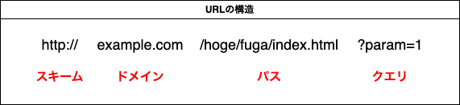

# URL
## URL の構造
Uniform Resource Locator（ユニフォーム リソース ロケータ、URL）
または、
統一資源位置指定子（とういつしげんいちしていし）

▼URLの構造

例：google で、「URLとは」と検索するURLの場合
`https://www.google.co.jp/search?q=URLとは`

## 厳密な定義
httpsやftpのような特定のホストにIP接続する類のスキームでは次のような共通の形式が使われている。

`<scheme>//<user>:<password>@<host>:<port>/<url-path>?<query-string>`

| 項目名           | 説明                                                                                                                            |
| ---------------- | ------------------------------------------------------------------------------------------------------------------------------- |
| `<user>`         | ホストに接続するときに使うユーザー名。必要がなければ省略可。                                                                    |
| `<password>`     | ユーザー名に対応するパスワード。必要がなければ省略可。                                                                          |
| `<host>`         | ホスト名、FQDNまたはIPアドレス。例: `https://192.168.10.2/`（IPv4の場合）、`https://[fe80::a1b3:125d:c1f8:4781]/`（IPv6の場合） |
| `<port>`         | 接続先ポート番号。ホストのどのポートに接続するかを表す。スキームがデフォルトのポート番号を規定している場合は省略してもよい。    |
| `<url-path>`     | ホストに要求するパス。ホストのファイルシステムにおけるパスと対応する場合が多いが、そうでない場合もある。必要がなければ省略可。  |
| `<query-string>` | 接続先が利用するパラメータ。`?`に続いて任意の形式でデータを記述する。省略可。正式名は「URL-query string」。                     |

## FQDN とは
FQDN（読：エフキューディーエヌ）とは
「Fully Qualified Domain Name」の略。
完全修飾ドメイン名

ホスト名、サブドメイン名を省略せずに全て記述したドメイン名のこと。

`https://www.google.co.jp` の場合
- `google.co.jp`はドメイン名
- `www.google.co.jp`はFQDN

## URI について
> Uniform Resource Identifiers (統一リソース識別子、URI) は、ウェブ上の「リソース」を識別するために使用されます。
> これらは一般的に HTTP リクエストの対象として使用され、その場合、URI は文書、写真、バイナリーデータなどの物理的なリソースの場所を表します。
> URI は、HTML の <a> リンクの href など、他の場所で使用された場合、リソースを取得する以外の動作を起動するために使用することもできます。
引用：[HTTP メッセージ - HTTP | MDN](https://developer.mozilla.org/ja/docs/Web/HTTP/Messages)

### URL との違い
URIはリソースを識別するための汎用的な概念であり、URLはそのURIの中で特にリソースの場所を示すものです。すべてのURLはURIの一部ですが、すべてのURIがURLであるわけではありません。

#### URI（Uniform Resource Identifier）

- 定義: URIは、インターネット上でリソースを一意に識別するための文字列です。リソースの場所（位置）だけでなく、そのリソース自体を識別する役割も持ちます。
- 種類: URIには、URLやURN（Uniform Resource Name）が含まれます。URNはリソースの名前を識別するもので、場所に依存しません。
- 例:
  - mailto:info@example.com（メールアドレス）
  - isbn:978-3-16-148410-0（本のISBN）

#### URL（Uniform Resource Locator）

- 定義: URLは、インターネット上でリソースの場所を特定するためのURIの一種です。リソースがどこにあるか（アクセス方法や場所）を示します。
- 構成要素: URLは、プロトコル（例: http、https、ftp）やドメイン名、ポート番号、パス、クエリパラメータなどを含みます。
- 例:
  - https://www.example.com/index.html
  - ftp://ftp.example.com/file.txt