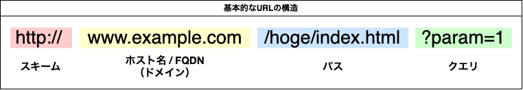

# URL
## URL の構造
Uniform Resource Locator（ユニフォーム リソース ロケータ、URL）
または、
統一資源位置指定子（とういつしげんいちしていし）

▼URLの構造

例：google で、「URLとは」と検索するURLの場合
`https://www.google.co.jp/search?q=URLとは`

## 厳密な定義
httpsやftpのような特定のホストにIP接続する類のスキームでは次のような共通の形式が使われている。

`<scheme>//<user>:<password>@<host>:<port>/<url-path>?<query-string>`

| 項目名           | 説明                                                                                                                            |
| ---------------- | ------------------------------------------------------------------------------------------------------------------------------- |
| `<user>`         | ホストに接続するときに使うユーザー名。必要がなければ省略可。                                                                    |
| `<password>`     | ユーザー名に対応するパスワード。必要がなければ省略可。                                                                          |
| `<host>`         | ホスト名、FQDNまたはIPアドレス。例: `https://192.168.10.2/`（IPv4の場合）、`https://[fe80::a1b3:125d:c1f8:4781]/`（IPv6の場合） |
| `<port>`         | 接続先ポート番号。ホストのどのポートに接続するかを表す。スキームがデフォルトのポート番号を規定している場合は省略してもよい。    |
| `<url-path>`     | ホストに要求するパス。ホストのファイルシステムにおけるパスと対応する場合が多いが、そうでない場合もある。必要がなければ省略可。  |
| `<query-string>` | 接続先が利用するパラメータ。`?`に続いて任意の形式でデータを記述する。省略可。正式名は「URL-query string」。                     |

## FQDN とは
FQDN（読：エフキューディーエヌ）とは
「Fully Qualified Domain Name」の略。
完全修飾ドメイン名

ホスト名、サブドメイン名を省略せずに全て記述したドメイン名のこと。

`https://www.google.co.jp` の場合
- `google.co.jp`はドメイン名
- `www.google.co.jp`はFQDN